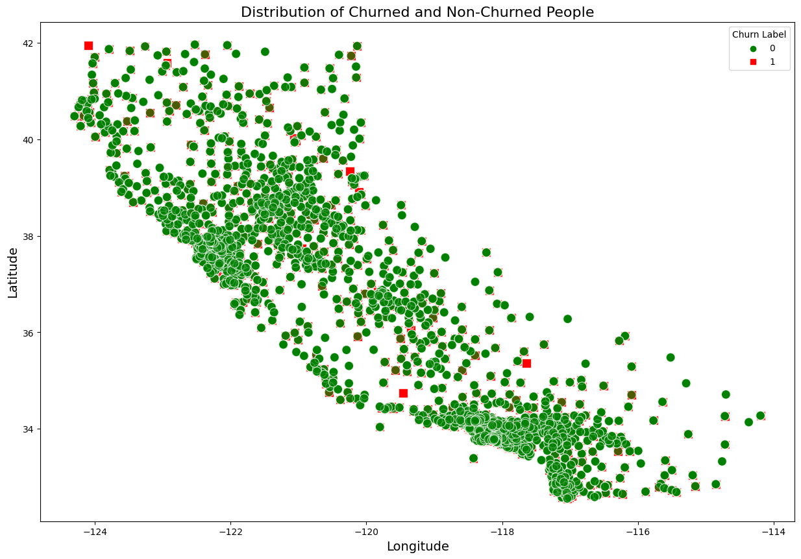
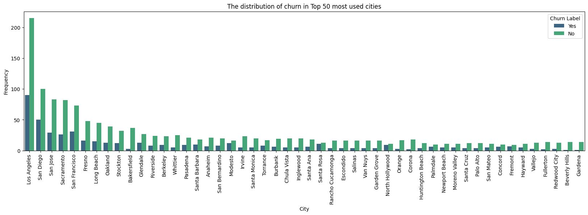
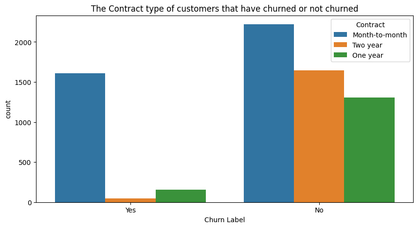
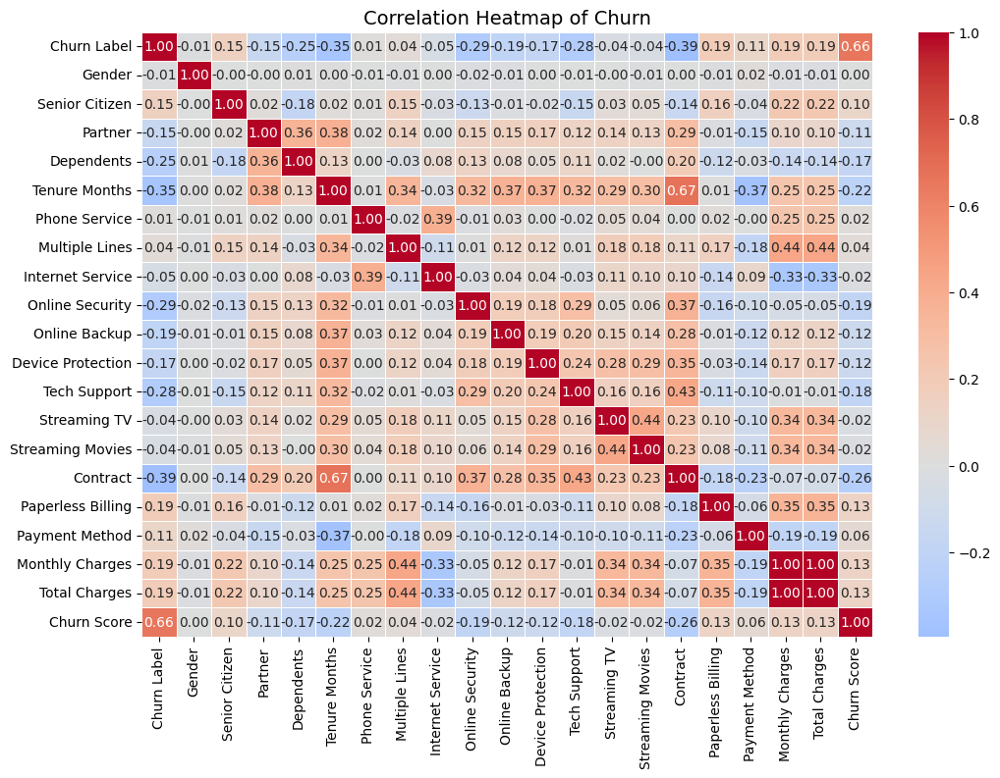
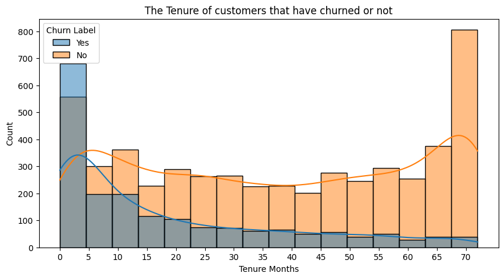
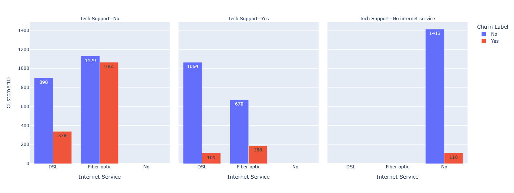
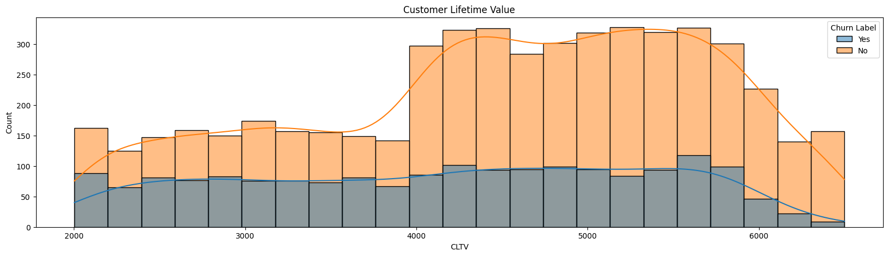
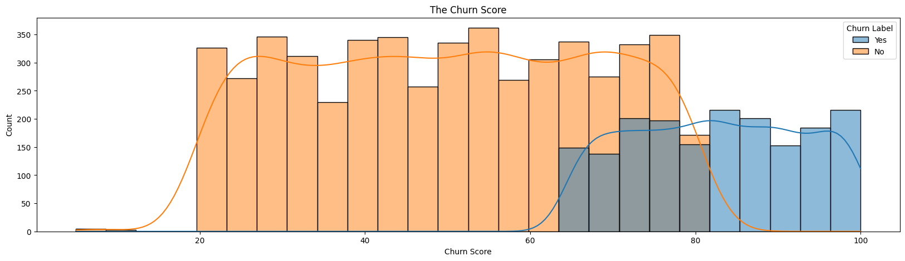
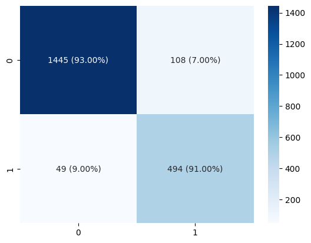

# 📊 Telco Customer Churn: A Deep Dive Predictive Analysis

An exhaustive, end-to-end data science project that performs a deep exploratory analysis on a Telco customer dataset to build a high-performance churn prediction model. This repository documents every step, from initial data cleaning to the final model evaluation, which achieved an **0.89 ROC AUC score**.

---

## 📁 Project Structure

```
Telco-Customer-Churn/
├── data/
│   └── Telco_Customer_Churn.csv  # Raw dataset
├── notebooks/
│   └── analysis_and_modeling.ipynb           # Main Jupyter Notebook
├── visualizations/
│   ├── churn_distribution.jpg
│   ├── demographic_churn_analysis.png
│   ├── contract_churn.png
│   ├── billing_churn.png
│   ├── service_churn_analysis.png
│   ├── tenure_churn.png
│   ├── newplot.png
│   ├── customer_lifetime_value.png
│   ├── roc_auc_curve.png
│   └── confusion_matrix.png
├── requirements.txt                          # Python dependencies
└── README.md                                 # This file
```

---

## 🗃️ Dataset Overview

* **Source:** [Kaggle: Telco Customer Churn](https://www.kaggle.com/datasets/blastchar/telco-customer-churn)
* **Description:** A dataset containing 7,043 customer records with 21 attributes, including demographic data, subscribed services, account information, and the target variable, `Churn`.

---

## 📈 All Visualizations & Key Insights

This section provides a complete visual narrative of the exploratory data analysis, with each chart uncovering a different facet of customer churn behavior.

### 1. Overall Churn Distribution
The analysis begins by establishing the baseline churn rate. The dataset is imbalanced, with **26.5%** of customers having churned. This imbalance informs our choice of evaluation metrics like ROC AUC.



### 2. Demographic Analysis
**Insight:** While gender is not a factor, **Senior Citizens churn at a higher rate**. Having a partner and dependents appears to be a stabilizing factor, significantly reducing the likelihood of churn.



### 3. Contract Term Impact on Churn
**Insight:** This is the most significant predictor. Customers on **Month-to-Month contracts have an extremely high churn rate (over 40%)** compared to those on one or two-year contracts, who are far more loyal.



### 4. Billing and Payment Method Analysis
**Insight:** Customers using **Paperless Billing** and paying via **Electronic Check** are significantly more likely to churn. This may indicate dissatisfaction with the digital billing process or issues related to this specific payment method.


### 5. Service Subscription Analysis
**Insight:** Customers **without Online Security, Online Backup, and Tech Support services are far more vulnerable to churn**. Conversely, having these protective services acts as a strong retention factor. The type of internet service also matters, with **Fiber optic customers churning more often** than DSL users.



### 6. Tenure Impact on Churn
**Insight:** Churn is heavily skewed towards **new customers**. The first few months are critical, as the churn rate is highest for customers with low tenure. Loyalty builds over time.



### 7. Correlation Heatmap of Features
**Insight:** The heatmap confirms the strong relationships identified earlier. **Tenure and Contract type have a strong negative correlation with Churn**, while Monthly Charges has a positive correlation.



### 8. Customer Lifetime Value (CLV) Analysis
**Insight:** An analysis of Customer Lifetime Value reveals that churning customers are often those with lower long-term value. However, the model can be used to prioritize retention efforts on **high-CLV customers who are flagged as high-risk**, maximizing the financial impact of the retention strategy.



---

## 🎯 Final Model Performance

The XGBoost Classifier delivered the best performance, validating the insights from our EDA.

* **ROC AUC Score:** **0.89**. This indicates a very high capability to distinguish between churning and non-churning customers.
* **Confusion Matrix:** The model correctly identifies a significant number of true churners while maintaining high overall accuracy, making it a reliable tool for business action.




---

## 🛠️ Tech Stack & Setup

* **Language:** Python 3.x
* **Libraries:** Pandas, NumPy, Scikit-learn, Matplotlib, Seaborn, XGBoost
* **Environment:** Jupyter Notebook

### How to Run:

1.  **Clone the repository:**
    ```bash
    git clone [https://github.com/YourUsername/Telco-Customer-Churn.git](https://github.com/YourUsername/Telco-Customer-Churn.git)
    cd Telco-Customer-Churn
    ```

2.  **Set up a virtual environment:**
    ```bash
    python -m venv venv
    source venv/bin/activate  # On macOS/Linux
    venv\Scripts\activate      # On Windows
    ```

3.  **Install dependencies:**
    ```bash
    pip install -r requirements.txt
    ```

4.  **Launch Jupyter and run the notebook:**
    ```bash
    jupyter notebook
    ```
Suggestions and feedback are always welcome.
Project developed by Anirudh Singla
